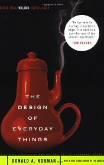
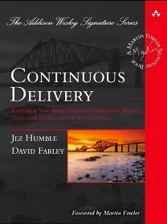
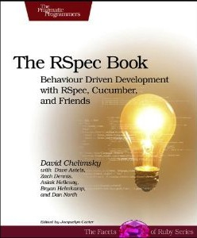
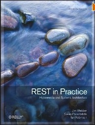
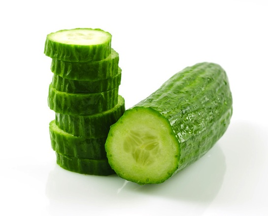

<!SLIDE>
.notes Hello, everyone. My name is…

# Hi, everyone! #

<!SLIDE>
.notes …Luismi Cavallé. I'm just…
# Luismi Cavallé #

<!SLIDE>
.notes …'cavalle' in twitter and github.
## twitter.com/cavalle

## github.com/cavalle

<!SLIDE>
.notes This is how my last name is pronounced: kah-bah-yeah
# _ka-bah-yeah_

<!SLIDE center karateka>
.notes This is my avatar in github, and this…

  

<!SLIDE center karateka2>
.notes is the original picture. But what I would like to talk you tonight is about a gem I'm author of…

  

<!SLIDE center>
.notes Steak. The first released version of Steak is from…

<!SLIDE center>
.notes one and a half years ago, but I never talked about it in a conference before today.

<!SLIDE center>
.notes Why? Well, I must be honest with you: I was sort of…

# Why?

<!SLIDE center>
.notes ashamed because, I secretly knew that Yehuda Katz…

# Ashamed
## (sort of)

<!SLIDE center>
.notes I mean…

<!SLIDE center>
.notes Yehuda Katz… I knew that he was right when… 

<!SLIDE center wide>
.notes he said that Steak was a scam…

<!SLIDE>
.notes Essentially scam…

# _…Essentially a scam…_

<!SLIDE>
.notes Yes, my friends, I confess it to all of you tonight,

## A scam. a scam. a scam. a scam. a scam. a scam. a scam. a scam. a scam. a scam. a scam. a scam. a scam. a scam. a scam. a scam. a scam. a scam. a scam. a scam. a scam. a scam. a scam. a scam. a scam. a scam. a scam

<!SLIDE>
.notes I'm a liar. You should have heard…

# I'm a liar

<!SLIDE wide center>
.notes Yehuda, because… 

<!SLIDE inlineimages>
.notes Yehuda is always right

##  is always right

<!SLIDE>
.notes But before going on with my confession I have to tell you about something else.

# »

<!SLIDE>
.notes One of my wishes has always been to be able to read a book every week. I'm a very bad reader, I got…

# One book a week

<!SLIDE>
.notes distracted and lose concentration quite easily

## Distracted and concentration lost 

<!SLIDE>
.notes So, no, reading one book each week is nearly impossible for me. However, at the beginning of this year…

# Impossible!
## :(

<!SLIDE>
.notes I had this crazy idea: ok, I cannot finish a book each week…

# Crazy Idea

<!SLIDE>
.notes but what about starting a new book every week?

<h2>What about <em><u>starting</u></em> a new book every week?</h2>

<!SLIDE>
.notes That's something I could do. Would it make any sense?

# Yes we can

<!SLIDE>
.notes I didn't know, probably not, but still, I decided to try.

# ¿?

<!SLIDE mosaic>
.notes Six months later I can tell you that the experiment is working quite well: Of course, I didn't finish most of the books I started, but I'm reading more than ever, I feel very motivated to do so and I no longer feel guilty and get stuck when I lose interest in my current book.

<!SLIDE>
.notes This brings me to one of the books I've finished during this experiment:

# »

<!SLIDE center>
.notes “All marketers are liars”

<!SLIDE center>
.notes by Seth Godin. In this book Godin states that marketing is all about

<!SLIDE>
.notes lies… (so nothing new under the sun, right?)

# Lies

<!SLIDE>
.notes What he means is the lies that we tell ourselves everyday. Yes, my friends

<h2>Lies we <em><u>tell ourselves</u></em> everyday</h2>

<!SLIDE>
.notes I'm a liar…

## I'm a liar

<!SLIDE>
.notes But you are too

# You are, too!

<!SLIDE>
.notes Our knowledge of the world is absolutely minimal, but that's ok because we are provided…

# Ignorance == 99.999… %

<!SLIDE>
.notes with a brain able to fill our gaps of knowledge by just inventing it

# Your brain fills the gaps

<!SLIDE>
.notes This is how we work: we tell ourselves lies all the time in order to understand the world. What marketers do, then, is taking advantage of this basic mechanism in order to make an idea spread…

## Telling lies to understand the world

<!SLIDE>
.notes Because, according to Seth Godin, that's what Marketing is about: spreading ideas, putting new ideas in our brains…

# The art of spreading ideas 

<!SLIDE>
.notes by telling us stories and letting us to fool ourselves

# Tell stories

<!SLIDE>
.notes So best marketers don't tell the lies

# Don't tell lies

<!SLIDE>
.notes they only tell the stories.

# Tell stories

<!SLIDE>
.notes The things is, while I was reading this book, all these ideas resonated with me and with Steak.

# Back to Steak…

<!SLIDE center>
.notes Two years ago, after having been working with Cucumber and its previous incarnations for a year

<!SLIDE>
.notes I thought that RSpec and Webrat were probably all I needed for Acceptance testing. And I thought that that was an idea worth spreading

## The idea:
## _“RSpec + Webrat for Acceptance testing is cool”_

<!SLIDE>
.notes So, as any marketer would do, I started to tell a story

# Tell the story

<!SLIDE>
.notes I could have written a blog post…

# Blog post?

<!SLIDE>
.notes or spoke at a conference

# Conference?

<!SLIDE>
.notes But I decided to write a ruby gem. Why?

# Ruby Gem!

<!SLIDE>
.notes First, because that is what I do best, writting code, but the main reason is that, as Godin explains in his book,

# I love coding

<!SLIDE>
.notes it's not only about telling stories

## Telling the story is not enough

<!SLIDE>
.notes it is about living them.

<h2>You have to <u><em>live</em></u> the story</h2>

<!SLIDE center autoplay>
.notes You may have seen this video. It is from a TED talk by Derek Shivers, titled "How to start a movement". Our hero here is a guy that had an idea: 'Dancing over the grass must be fun'. He could have tweeted about it or written a blog post. He could have started a discussion in Hacker News about how fun is to dance over the grass. But, instead of that, he opted to tell the story by living it. And he succeeds. He succeeds epicly. Why? Because one of the most powerful ways of selling an idea to others is by living the story you tell about it. And that's what I tried to do with Steak.

<video src='/image/steak/dancingguy.webm' width='100%' height='100%'></video>

<!SLIDE>
.notes So, yes, Steak is a scam (if you want)

# Steak is a scam

<!SLIDE>
.notes Steak is a lie (one that you tell to yourself)

# Steak is a lie

<!SLIDE>
.notes Steak is a marketing campaign

# Steak is a marketing campaign

<!SLIDE>
.notes Steak is a story I started to tell and live in order to spread an idea that, I thought

# Steak is a story

<!SLIDE>
.notes was worth spreading.

# An idea worth spreading ™

<!SLIDE>
.notes And that's all. Thank you very much!

# Thank you!
### steak-is-a-scam.heroku.com